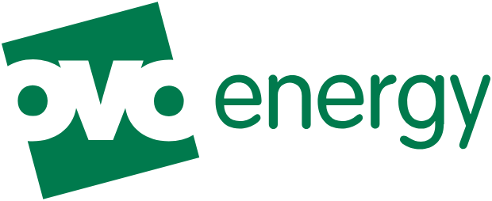

# OVO Energy Australia for Home Assistant

> ### 🎁 New to OVO? Get **$180 credit**
>
> - **Referral code:** `daniel16485`
> - **Direct OVO signup:** [https://www.ovoenergy.com.au/refer/daniel16485](https://www.ovoenergy.com.au/refer/daniel16485)
> - **Friendly link:** [https://ovoreferralcode.com/](https://ovoreferralcode.com/)
>
> Get **$180 off your bills**, paid as **$15/month for 12 months**. You get $180, I get $180 — and referrals help fund this project. 💚
>
> **Already an OVO customer?** [Support me on Buy Me a Coffee](https://buymeacoffee.com/hallyaus).

<div align="center">



<br/><br/>

[](https://my.home-assistant.io/redirect/hacs_repository/?owner=HallyAus&repository=OVO_Aus_api&category=integration)
[](https://github.com/HallyAus/OVO_Aus_api/actions/workflows/ci.yml)
[](https://github.com/HallyAus/OVO_Aus_api/releases/latest)
[](https://github.com/HallyAus/OVO_Aus_api/releases)
[](LICENSE)
[](https://www.home-assistant.io/)
[](https://www.python.org/)


[](https://buymeacoffee.com/hallyaus)

**Comprehensive Home Assistant integration for OVO Energy Australia**

Track delayed meter usage, solar generation, grid imports and exports, bills,
tariffs, plan savings, and connected vehicles from Home Assistant.

**105 account entities · 19 optional vehicle entities · 169 automated tests**

[Features](#features) · [Quick Start](#quick-start) · [Sensors](#sensors) · [Dashboards](#dashboard-examples) · [Contributing](#contributing)

</div>

> [!NOTE]
> The download badge counts attached GitHub release ZIPs. GitHub does not count
> HACS installs or source-code archives there, so it is not a total-user count.

---

## 💚 Support this project — it's my only income from it

If this integration saves you money or time, please use one of the referrals
below or support the project directly. This project is maintained in my spare
time, and community support funds ongoing development.

### ⭐ Star this repo
[**⭐ Star on GitHub**](https://github.com/HallyAus/OVO_Aus_api) — takes two seconds and genuinely helps. Stars surface the project to other OVO customers.

### 🎁 OVO Energy referral — $180 credit
Not an OVO customer yet? Sign up through my referral site (the code `daniel16485` attaches automatically):

- **Referral code:** `daniel16485`
- **Direct OVO signup:** [https://www.ovoenergy.com.au/refer/daniel16485](https://www.ovoenergy.com.au/refer/daniel16485)
- **Friendly link:** [https://ovoreferralcode.com/](https://ovoreferralcode.com/)

- ✅ **$180 credit** (incl. GST), paid as $15/month over 12 months
- ✅ Available on **all eligible plans** — including The EV Plan (no EV required)
- ✅ Both you and I receive the full $180 — win-win
- ✅ NSW, VIC, QLD & SA · must be your first OVO energy market contract

### ☕ Already an OVO customer? Support me here

If you cannot use the referral, you can support continued development directly:

<a href="https://buymeacoffee.com/hallyaus">
  
</a>

**[buymeacoffee.com/hallyaus](https://buymeacoffee.com/hallyaus)**

### 🛰️ Starlink referral — 1 month free
Running Home Assistant somewhere rural or need a reliable backup link?

**👉 [starlink.com/residential?referral=RC-2455784-77014-69](https://starlink.com/residential?referral=RC-2455784-77014-69&app_source=share)**

- ✅ One free month of Starlink service
- ✅ Works anywhere with a clear view of sky

---

## ⚡ Home Assistant Energy Dashboard

The integration ships three sensors purpose-built for HA's built-in **Energy Dashboard** (Settings → Energy). In each picker, choose the matching sensor from the **Energy Dashboard** device:

| Dashboard slot | Pick the sensor named |
|----------------|-----------------------|
| **Grid consumption** | *Grid Import (Energy Dashboard)* |
| **Return to grid** | *Grid Export (Energy Dashboard)* |
| **Solar production** | *Solar Production (Energy Dashboard)* |

These are cumulative month-to-date totals (`state_class: total` with a monthly `last_reset`), which is the form the Energy Dashboard expects — so daily and monthly bars populate correctly. Note OVO publishes usage with about a day's delay, so the dashboard fills in a day behind.

---

## ✨ Features

### 📊 Comprehensive Sensors with Automatic Plan Detection

The integration connects to OVO's GraphQL API and detects recognised plans,
available rates, and account details automatically. Distributor-specific TOU
peak boundaries can be supplied in Configure when OVO does not return them.

| Category | What You Get |
|----------|-------------|
| **Daily / Monthly / Yearly** | Solar generation, grid consumption, export -- both kWh and AUD |
| **Rate Breakdown** | Yesterday, month, year, and all-time tariff detail without rotating Day 1-7 entities |
| **Plan Savings** | One entity with daily, monthly, and yearly OVO-calculated savings attributes |
| **Hourly Data** | 7-day rolling window with per-hour granularity and heatmap sensor |
| **Week-over-Week Comparison** | This week vs last week with net usage cost after export credit |
| **Weekday vs Weekend Analysis** | Household consumption and net usage cost by day type |
| **Solar Self-Sufficiency** | Percentage of energy consumed from your own panels |
| **Bill Estimator** | The single forecast, including standing charges and export credits |
| **Cost per kWh** | Net household usage, grid import, and export-credit rates |
| **High Usage Day Rankings** | Top household-use days: grid import + self-consumed solar |
| **Hourly Heatmap** | Usage patterns by day-of-week and hour |
| **Solar Export Analysis** | Export credit, export rate, opportunity cost vs self-consumption |
| **Account Balance** | Current OVO account balance |
| **Plan Information** | Diagnostic sensor with all plan rates, standing/demand charges and applicable schedule windows |
| **Integration Health** | API health plus newest usage date, expected delay, and stale-data warning |
| **⚡ Tariff Period Indicator** | Shows the scheduled current rate and next change for Free 3, Free 4, EV, flat and configured TOU plans |
| **🔌 EV Charging Tracker** | Monthly and yearly EV charging kWh and cost |
| **🚗 Connected Vehicle** | Live battery/range/cable/mode, charge limit and boost state, readiness/credential health, charging preferences and weekly/tariff schedules, full charge-plan windows, demand-period settings, and monthly vehicle kWh/cost/rate history |

### 🏠 Real-World Results

One user on the **EV Plan** sees:

- **$1,066/year saved** vs the One Plan (OVO-calculated)
- **30--50 kWh/day** solar generation
- **8c/kWh** overnight EV charging (vs 37c standard rate)
- **Free electricity** 11 am -- 2 pm daily
- **2.8c/kWh** feed-in tariff

### ⚡ Technical Highlights

- **OAuth2 PKCE** authentication via Auth0 with automatic token refresh
- **401 retry** with automatic re-authentication
- **DST-aware** timezone handling using `ZoneInfo("Australia/Sydney")`
- **Dynamic hourly sensors** that survive midnight without a restart
- **Data-driven architecture** -- add sensors by editing a list, not writing classes
- **169 automated tests** with CI/CD via GitHub Actions
- **HACS compatible** with one-click install

---

## 🚀 Quick Start

### Install via HACS (Recommended)

Click the button below to add the repository in one step:

[](https://my.home-assistant.io/redirect/hacs_repository/?owner=HallyAus&repository=OVO_Aus_api&category=integration)

Or manually:

1. Open **HACS** > **Integrations** > three-dot menu > **Custom repositories**
2. Add `https://github.com/HallyAus/OVO_Aus_api` as an **Integration**
3. Click **Download**
4. Restart Home Assistant

### Manual Install

1. Download the [latest release ZIP](https://github.com/HallyAus/OVO_Aus_api/releases/latest/download/ovo_energy_au.zip)
2. Copy `custom_components/ovo_energy_au` into your `config/custom_components/` directory
3. Restart Home Assistant

### Configure

1. Go to **Settings** > **Devices & Services** > **Add Integration**
2. Search for **OVO Energy Australia**
3. Enter your OVO email and password
4. Done -- your plan, rates, and core sensors are created automatically

> [!IMPORTANT]
> Home Assistant **2026.8.3 or newer** is required. Older Container releases can
> fail to install the integration's PyJWT requirement before setup (#81).

The focused account surface contains 105 entities; an enrolled vehicle adds 19
on its own linked device. Upgrades remove 161 obsolete moving Day 1-7/hourly-day
registry entries plus 15 scalar entities replaced by richer summaries.

If your account is enrolled in OVO EV Control, a separate vehicle device is
created automatically. It uses the same MyOVO login and read-only requests; no
extra token or setup is required. VIN, location/home state, raw platform IDs,
and vendor certificate URLs are discarded before data reaches Home Assistant.
This release does not start charging or change vehicle settings.

> [!WARNING]
> **Don't pick the built-in "OVO Energy" integration.** Home Assistant ships a
> separate OVO UK integration (`ovo_energy`). Select **OVO Energy Australia**
> (`ovo_energy_au`). If a log mentions `homeassistant/components/ovo_energy` or
> `No customer id set`, remove the UK integration and add this one instead.

### Tariff Schedule and Peak/Off-Peak Split (Optional)

Free 3 (11am-2pm), Free 4 (11am-3pm), and EV overnight (midnight-6am) product windows are applied automatically. OVO's API does not provide every distributor-specific peak boundary and can report paid usage as one `OTHER` bucket. Open the integration's **Configure** dialog and set **Peak Window Start/End Hour** (for example, 15 and 21 for 3pm-9pm). Current Tariff Period and the hourly TOU breakdown then report Peak inside that window and Off-Peak outside it. Leave both values equal to disable the manual split.

When an account moves to another recognised OVO plan, the integration detects the new plan on refresh. A plan explicitly saved in **Configure** remains a manual override.

---

## 📡 Sensors

All sensors are grouped into logical device categories in Home Assistant for easy navigation.

### ⚡ Core Energy (Daily / Monthly / Yearly)

| Sensor | Unit | Description |
|--------|------|-------------|
| Solar Consumption | kWh | Energy consumed from solar panels |
| Grid Consumption | kWh | Energy drawn from the grid |
| Return to Grid | kWh | Energy exported to the grid |
| Solar Feed-in Credit | AUD | Credit earned from solar export |
| Grid Charge | AUD | Cost of grid energy |
| Return to Grid Charge | AUD | Value of exported energy |

These six sensors are available for each period: **Yesterday**, **This Month**, **This Year**, **Last Week**, **Last Month**, and **Month to Date**.

### 💰 Rate Breakdown

Stable summaries for Yesterday, This Month, This Year, and All Time show
consumption and cost split by rate type without rotating Day 1–7 entity IDs:

| Rate Type | Example Use |
|-----------|-------------|
| `EV_OFFPEAK` | Overnight EV charging at discounted rate |
| `FREE_3` | Free electricity window (e.g., 11 am -- 2 pm) |
| `PEAK` | Highest-cost period |
| `SHOULDER` | Mid-cost period |
| `OFF_PEAK` | Standard off-peak |
| `OTHER` | Catch-all for remaining intervals |

Each summary also includes counterfactual analysis showing what the same usage
would have cost on another rate structure.

### 🏆 OVO Savings

| Sensor | State and attributes |
|--------|----------------------|
| Plan Savings | Yearly summary state; daily, monthly, yearly, comparison, rating, and recommendation attributes |

These values are calculated by OVO's own comparison engine, not estimated locally.

### 🧠 Analytics & Insights

| Sensor Group | Sensors | Purpose |
|-------------|---------|---------|
| Week Comparison | 6 | This week vs last week (solar, grid, net usage cost + % change) |
| Weekday vs Weekend | 4 | Household consumption and net usage cost by day type |
| Peak Usage | 1 | Highest consumption 4-hour window |
| Self-Sufficiency | 1 | Percentage of energy from solar |
| High Usage Days | 1 | Top 5 consumption days (last 30 days) |
| Hourly Heatmap | 1 | Day-of-week / hour usage grid |
| Cost per kWh | 3 | Net usage, grid-import, and export-credit rates |
| Bill Estimate | 4 | MTD, projected, remaining, and daily average including supply charges |
| Solar Export | 4 | Export credit, rate, potential savings, opportunity cost |

### ⏰ Hourly Data

- **7-day rolling window** with solar, grid, and export totals
- **Yesterday hourly** sensors for quick graph display
- Full hourly entries available in sensor attributes
- OVO meter usage is not real-time; yesterday's complete data normally arrives the following morning

### 🔧 Other

| Sensor | Category |
|--------|----------|
| Account Balance | Account |
| Plan Information | Diagnostic |
| Integration Health | Diagnostic |

---

## 📊 Dashboard Examples

Ready-to-use YAML dashboard configurations are included in [`docs/dashboards/`](docs/dashboards/):

| File | Description |
|------|-------------|
| `dashboard_simple.yaml` | Built-in cards only -- no custom components needed |
| `dashboard_example.yaml` | Comprehensive 4-view dashboard (mushroom + apexcharts) |
| `dashboard_hourly.yaml` | Dedicated hourly charts with solar/grid/export overlays |

Copy any of these into your Lovelace dashboard configuration to get started. They use standard Home Assistant cards and [ApexCharts Card](https://github.com/RomRider/apexcharts-card) for graphs.

### Quick Example

```yaml
type: entities
title: Yesterday's Energy
entities:
  - sensor.ovo_energy_au_yesterday_solar_consumption
  - sensor.ovo_energy_au_yesterday_grid_consumption
  - sensor.ovo_energy_au_yesterday_return_to_grid
  - sensor.ovo_energy_au_yesterday_grid_charge
  - sensor.ovo_energy_au_ovo_savings_plan_savings
```

---

## 🏗️ Technical Details

### Architecture

```
custom_components/ovo_energy_au/
  __init__.py          # Integration setup and lifecycle
  coordinator.py       # DataUpdateCoordinator, 5-min polling
  api.py               # OAuth2 PKCE auth, GraphQL client
  sensor.py            # Sensor platform and rich summary entities
  config_flow.py       # UI config + options flow
  models.py            # TypedDict / dataclass definitions
  const.py             # Constants and plan defaults
  graphql/
    queries.py         # All GraphQL query strings
  sensors/
    definitions.py     # Data-driven sensor definitions
    base.py            # Base sensor classes
  analytics/
    interval.py        # Daily/monthly/yearly aggregation
    hourly.py          # Hourly data processing
    insights.py        # Derived analytics (week comparison, heatmap, etc.)
```

### API

The integration communicates with OVO Energy Australia's GraphQL API:

- **Authentication:** OAuth2 PKCE flow via Auth0 (`auth.ovoenergy.com.au`)
- **Token refresh:** Automatic, with 401 retry and re-authentication fallback
- **Polling interval:** 5 minutes via Home Assistant's `DataUpdateCoordinator`
- **Data source:** Daily data is available after 6:00 AM for the previous day
- **Timezone:** `ZoneInfo("Australia/Sydney")` -- handles AEST/AEDT transitions correctly

### Null Safety

OVO's API can return `null` for charge fields when data is not yet available. All sensors handle this gracefully and show "Unknown" rather than crashing.

---

## 🔍 Troubleshooting

| Problem | Solution |
|---------|----------|
| OAuth authentication fails | Verify credentials are for OVO Energy **Australia** (not UK). Check HA logs for details. |
| Sensors show "Unknown" | Wait until after 6:00 AM for yesterday's data. Check the Integration Health diagnostic sensor. |
| Sensors missing after install | Restart Home Assistant. Check Developer Tools > States for `ovo_energy_au` entities. |
| Token expires frequently | The integration handles this automatically. If persistent, remove and re-add the integration. |
| “Entity no longer has a state class” after v4.8.2 | Upgrade and restart. v4.9+ removes the affected rotating Day 1-7 entities. If Home Assistant still offers to delete their orphaned long-term statistics, that history belonged to moving day labels and can be removed from the repair dialog; normal state history and current stable entities are unaffected. |

---

## 🤝 Contributing

Contributions are welcome. Here is how to get started:

1. Fork the repository
2. Create a feature branch (`git checkout -b feature/my-change`)
3. Run tests: `pytest tests/`
4. Run linting: `ruff check .`
5. Submit a pull request

### Areas Where Help Is Appreciated

- Dashboard templates and card examples
- Testing with different OVO plan types (Basic, One, Free 3, Free 4, EV)
- Documentation and guides
- Support for additional tariff structures

See [`CHANGELOG.md`](CHANGELOG.md) for version history and [`CLAUDE.md`](CLAUDE.md) for the project development guide.

---

## 💬 Support

- **Issues:** [GitHub Issues](https://github.com/HallyAus/OVO_Aus_api/issues)
- **Buy Me a Coffee:** [buymeacoffee.com/hallyaus](https://buymeacoffee.com/hallyaus)

---

**Disclaimer:** This is an unofficial, community-built integration. It is not affiliated with, endorsed by, or supported by OVO Energy Australia.

---

<div align="center">

Built for the Australian solar and EV community.

</div>
